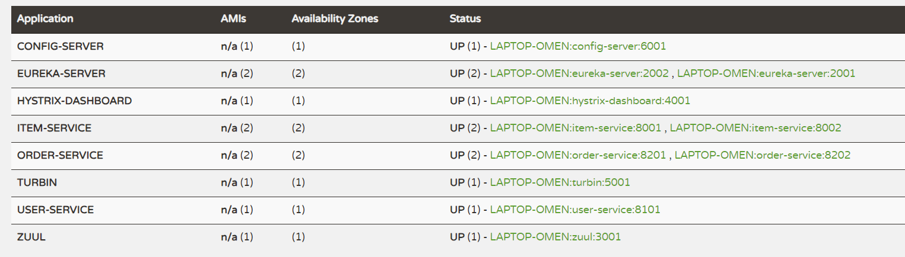

# try_to_learn_SpringCloud

https://blog.csdn.net/weixin_38305440/article/details/102775484
看的这个博文，学一学看看

pom写入这个之后，很多依赖都不用声明版本了。。省的一堆错。。
```xml
    <dependencyManagement>
        <dependencies>
            <dependency>
                <groupId>org.springframework.cloud</groupId>
                <artifactId>spring-cloud-dependencies</artifactId>
                <version>Hoxton.RELEASE</version>
                <type>pom</type>
                <scope>import</scope>
            </dependency>
        </dependencies>
    </dependencyManagement>
```

# 进程开启情况
